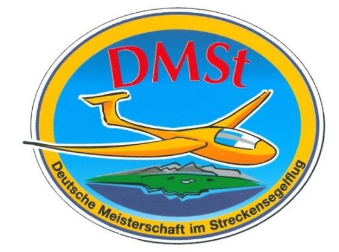

# DMSt-Wettbewerbsordnung

**Deutscher Aero Club e.V.**

## 1 Allgemeine Regeln

### 1.1 Zweck der DMSt

Förderung des Streckensegelfluges und des Leistungssegelflieger\*innen-Nachwuchses in den im DAeC organisierten Luftsportvereinen und Monoluftsportverbänden.
Ermittlung der Deutschen Meisterin / des Deutschen Meisters im Streckensegelflug.

### 1.2 Veranstalter

Veranstalter ist die Bundeskommission (Buko) Segelflug des DAeC in Zusammenarbeit mit den Segelflugkommissionen der Landesverbände und den Monoluftsportverbänden des DAeC.

### 1.3 Termin und Ort der Meisterschaft

Die DMSt findet im Wertungszeitraum vom 1. März 2021 bis zum 30. September 2021 statt. In den Folgejahren ist der DMSt Wertungszeitraum vom 1. Oktober bis 30. September definiert. Es werden nur Flüge gewertet, die in diesem Wertungszeitraum durchgeführt werden.
Die DMSt wird dezentral durchgeführt.

### 1.4 Vereine und Teilnehmende

Teilnehmende Vereine können Luftsportvereine sein, die einem Landesverband des DAeC oder einem Monoluftsportverband als Mitglied angehören. Teilnehmende können Segelflugzeugführer\*innen sein, die ordentliches Mitglied eines teilnehmenden Vereins, eines Luftsportverbandes, eines Monoluftsportverbandes oder des DAeC sind. Teilnehmende dürfen in einem Wertungszeitraum nur für einen teilnehmenden Verein melden. Mit dem ersten gemeldeten Flug legen die Teilnehmenden fest, für welchen Verein und Landesverband sie in diesem Wertungszeitraum teilnehmen.
Teilnehmende gelten dann als Junior\*innen, wenn deren 25. Geburtstag in dem Wertungszeitraum liegt oder sie jünger sind.

### 1.5 Regeln

Die Sorgfaltspflichten für die Einhaltung der gesetzlichen und behördlichen Bestimmungen, sowie der sonstigen für den Segelflug anzuwendenden Vorschriften und Empfehlungen liegen bei den Teilnehmenden.
Bezüglich der Festlegung von SR und SS und der damit in Zusammenhang stehenden Zeiten sind die Angaben bürgerlichen Dämmerungszeiten (SERA) auf der Seite [Datum und Uhrzeit](http://www.datum-und-uhrzeit.de) verbindlich.

Für die Anlage und Durchführung der Wertungsflüge gilt der Sporting Code, soweit keine davon abweichenden Regelungen in dieser DMSt-Wettbewerbsordnung enthalten sind.
Die Entfernungsberechnung erfolgt auf Basis des WGS84-Ellipsoids ([Vincenty’s Formel](https://en.wikipedia.org/wiki/Vincenty%27s_formulae)).
In den Wertungen werden ausschließlich Flüge mit Beginn des freien Fluges oder Abflugpunkt in Deutschland berücksichtigt.
Die Meldungen über Wertungsflüge sind online einzureichen über die Segelflug Online-Plattform weglide.org.

### 1.6 Meldung zur Meisterschaft

Der erste eingereichte Antrag auf Wertung eines Teilnehmenden gilt als Meldung zur Meisterschaft. Damit erkennt der Teilnehmende die DMSt-Regeln unter Ausschluss des Rechtsweges an. Mit dem Antrag auf Wertung erfolgt die Erhebung, Verarbeitung und Nutzung personenbezogener Daten des Teilnehmenden im Rahmen der Auswertung und der Veröffentlichung der Flugdaten. Es gelten die auf der für die Meldung der Flüge zu verwendender Internetplattform WeGlide einsehbaren Hinweise zum [Datenschutz](https://docs.weglide.org/docs/legal/privacy_policy/).

### 1.7 Verstöße

Teilnehmende Vereine und Personen, die durch unwahre Angaben oder unlautere Methoden Vorteile in der Wertung zu erringen suchen, können für die aktuelle DMSt disqualifiziert werden. Bei vorsätzlichen Verstößen gegen die DMSt-Regeln wird eine Sperre von 5 Jahren verhängt und der Name der betroffenen Person / des betroffenen Vereins veröffentlicht. Im Wiederholungsfall beträgt die Sperre 10 Jahre. Den Landesverbänden bleiben in diesen Fällen weitere Maßnahmen vorbehalten.

### 1.8 Einspruch

Einsprüche zu Wertungen sind an die/den von der Buko Segelflug für die DMSt eingesetzten DAeC Sportleiter\*in zu richten, die/der zusammen mit der/dem Vorsitzenden des RS/B entscheidet.
Ein Einspruch muss spätestens 48 Stunden nach der Wertung des Fluges an dmst@segelflug.aero erfolgen.
Ein Beschluss zu einem Einspruch soll zeitnah, spätestens jedoch bis zum 10. Oktober nach Ende des Wertungszeitraumes erfolgen.

### 1.9 Siegerehrung

Die Bekanntgabe und Veröffentlichung der Sieger\*innnen der DMSt des jeweiligen Wertungszeitraumes, sowie die Siegerehrung erfolgen beim nachfolgenden Deutschen Segelfliegertag.

## 2 Wertungen

Teilnehmende können beliebig viele Flüge zur Wertung anmelden.
Die Wertung eines Fluges erfolgt in der Klasse, die dem geflogenen Flugzeugmuster in der gültigen DAeC-Indexliste zugeordnet ist. Alle Flugzeuge bis einschließlich Index 106 können auch in der Clubklasse gewertet werden.
Flugzeuge der Clubklasse können mit variablem Ballast gemäß Flug- und Betriebshandbuch geflogen werden. Haben Teilnehmende Flüge auf Flugzeugen verschiedener Klassen gemeldet, werden sie in jeder dieser Klassen bzw. Wertungen gewertet.

Flüge in Doppelsitzern werden auch in der Frauen oder Junior\*innen Wertung ([2.2.1.1](#distance_women), [2.2.1.2](#distance_junior), [2.2.2.1](#speed_women), [2.2.2.2](#speed_junior)) berücksichtigt, wenn auch die/der Co-Pilot\*in Frau oder Junior\*in ist, oder wenn die Doppelsitzer einsitzig geflogen werden. Der einsitzige Doppelsitzerflug ist bei der online Flugeinreichung zu bestätigen.
Alle Flüge werden mit dem Index des Flugzeuges entsprechend der jeweils gültigen DAeC-Index-Liste bewertet.

###  2.1 Klassen-Streckenwertung

Sieger\*innen in den Streckenwertungen werden in folgenden Klassen ermittelt:

* Offene-Klasse
* 18m-Klasse
* 15m-Klasse
* Standard-Klasse
* Club-Klasse
* Doppelsitzer-Klasse

Sieger\*in in der jeweiligen Klasse ist die/der Teilnehmende mit der höchsten Punktzahl aus drei Flügen in dieser Klasse.

### 2.2 DMSt Ranglisten

#### 2.2.1  Rangliste Streckenwertung

In einer Rangliste Streckenwertung ([4.1](#distance_scoring)) werden die drei punkthöchsten Streckenflüge von Teilnehmenden aus den Einzelwertungen nach [2.1](#classes) berücksichtigt.

#####  2.2.1.1 Rangliste Streckenwertung Frauen

Die gewerteten Streckenflüge von Frauen werden zusätzlich in einer Rangliste Streckenwertung Frauen zusammengefasst.
Einzelsiegerin ist die Teilnehmerin mit der höchsten Punktzahl aus drei Flügen.

#####  2.2.1.2 Rangliste Streckenwertung Junior\*innen

Die gewerteten Streckenflüge von Junior\*innen werden zusätzlich in der Rangliste Streckenwertung Junior\*innen zusammengefasst.
Einzelsieger\*in ist die/der Teilnehmende mit der höchsten Punktzahl aus drei Flügen.

#### 2.2.2 Rangliste Geschwindigkeitswertung

In einer Rangliste Geschwindigkeitswertung werden die drei punkthöchsten Geschwindigkeitsflüge (siehe [4.2](#speed_scoring)) von Teilnehmenden aus den Klassen nach [2.1](#classes) berücksichtigt.

#####  2.2.2.1 Rangliste Geschwindigkeitswertung Frauen

Die gewerteten Geschwindigkeitspunkte von Teilnehmerinnen werden zusätzlich in einer Rangliste Geschwindigkeitswertung Frauen zusammengefasst.
Einzelsiegerin ist die Teilnehmerin mit der höchsten Punktzahl aus drei Flügen.

#####  2.2.2.2 Rangliste Geschwindigkeitswertung Junior\*innen

Die gewerteten Geschwindigkeitspunkten von Junior\*innen werden zusätzlich in der Rangliste Geschwindigkeitswertung Junior\*innen zusammengefasst.
Einzelsieger\*in ist die/der Teilnehmende mit der höchsten Punktzahl aus drei Flügen.

### 2.3 Teamstreckenwertung

Drei Teilnehmende eines teilnehmenden Vereines bilden mit ihrem punkthöchsten Streckenflug aus der Rangliste Streckenwertung gemäß [2.2.1](#distance) ein Team. Mehrere Teams pro Verein sind möglich. Teamsieger ist der teilnehmende Verein mit der höchsten Punktzahl seines Teams.

#### 2.3.1 Teamstreckenwertung Junior\*innen

Drei Teilnehmende eines teilnehmenden Vereines bilden mit ihrem punkthöchsten Flug aus der Rangliste Streckenflug Junior\*innen gemäß [2.2.1.2](#distance_junior) ein Junior\*innen-Team. Teamsieger ist der teilnehmende Verein mit der höchsten Punktzahl seines Junior\*innen-Teams.

### 2.4 DMSt Bundesliga

Die DMSt Bundesliga findet an allen Wochenenden zwischen dem 1. Mai 2021 und 22. August 2021 statt. Jedes Wochenende bildet dabei eine Runde.
Das Rundenergebnis des jeweiligen teilnehmenden Vereins an einem Wochenende berechnet sich als Summe aus:
den drei besten Ergebnissen von verschiedenen Teilnehmenden aus der Streckenwertung nach [4.1](#distance_scoring) gewichtet mit 10%
den drei besten Ergebnissen von verschiedenen Teilnehmenden aus der Geschwindigkeitswertung nach [4.2](#speed_scoring) gewichtet mit 100%
Die Teilnehmenden aus der Strecken- und Geschwindigkeitswertung können identisch sein.
Sieger der DMSt Bundesliga ist der teilnehmende Verein mit der höchsten Punktzahl.

## 3 Flugbeurkundung und –meldung

Die Beurkundung der Flüge ist nur mit IGC zugelassenen GNSS-Flugrekordern oder mit Positionsrekorder mit DAeC Zulassung (derzeit: Flarm ohne IGC-Zulassung und FlyWithCE) möglich.
Streckenflugaufgaben können online oder über einen GNSS Flugrekorder angemeldet werden:
Bei GNSS Flugrekordern gilt die letzte gültige Deklaration (C-Rekord im Flugrekorder) vor dem eigentlichen Flug.

Die Online Deklaration erfolgt über den Ausrichter der DMSt. Liegt eine Online-Deklaration vor, so ist die Deklaration im GNSS-Flugrekorder oder im Positionsrekorder nichtig. Die Online-Deklaration ist nur gültig, wenn sie
vor dem Start erfolgt und
nach dem Start bis zur Meldung des Fluges keine andere Online-Deklaration erfolgt.
Die IGC-Datei muss mit einer gültigen Signatur versehen sein (G-Rekord). Dies schließt ein, dass diese Datei mit standardisierten Verfahren validiert werden kann.

Die Verantwortung für die ordnungsgemäße Beurkundung liegt beim Teilnehmenden.
Ein Flug wird nur gewertet, wenn der Flug vom Abflug- zum Endpunkt ohne Motorunterstützung durchgeführt wurde und ein ununterbrochener Höhenschrieb sowie eine ordnungsgemäße Beurkundung des Flugweges vom Start bis zur Landung nachgewiesen werden. Bei Benutzung einer Motorunterstützung zwischen Abflug und Erreichen des End-punktes wird der Flug nur bis zur letzten, nachweislich ohne Antriebsunterstützung erreichten, Koordinate gewertet.

Das Intervall zwischen zwei Aufzeichnungspunkten soll vier Sekunden nicht überschreiten. Sofern technische Probleme auftreten, werden Ausfälle in der Flugaufzeichnung von maximal 120 Sekunden toleriert.
Die Flüge sind spätestens bis 12 Uhr (lokal) auf den Flug folgenden übernächsten Tag online zu melden.

## 4 Wertungsflüge und -verfahren

In der DMSt können sowohl für Strecken und Geschwindigkeitswertungen Punkte erflogen werden. Als Mindestwertung gilt für die Streckenwertung 50 Punkte und für die Geschwindigkeitswertung 25 Punkte.

###  4.1 Streckenwertung

Es können Strecken von einem Abflugpunkt über bis zu drei Wendepunkte (beim Vierecksflug maximal vier Wendepunkte und bei Mehrfachumrundungen maximal zwölf Wendepunkte) zu einem Endpunkt gewertet werden.
Die Höhendifferenz zwischen dem niedrigsten möglichen Abflugpunkt und dem höchsten möglichen Endpunkt darf maximal 1000m betragen.

####  4.1.1 Angemeldete Flüge

Bei einem angemeldeten Flug müssen alle Zielpunkte des Fluges (Abflug-, Wende- und Endpunkt) über die Angabe ihrer geografischen Koordinaten vor dem Start als Flugaufgabe im Flugrekorder oder über die Online Deklaration eindeutig und in der vorgegebenen Reihenfolge festgelegt werden. Abflug- und Endpunkt müssen identisch sein.
Ein Flug mit unterschiedlichen Flugaufgaben in verschiedenen Flug- oder Positionsrekordern ist nicht zulässig und wird als vorsätzlicher Verstoß gegen die DMSt- Regeln gewertet.
Die Zielpunkte sind in der vorgesehenen Reihenfolge anzufliegen und zu dokumentieren.

#### 4.1.2 Freie Flüge

Bei nicht angemeldeten, sogenannten „freien“ Flügen, werden als Abflug- Wende- und Endpunkt nur aufgezeichnete Koordinaten des Flugweges gewertet.
Freie Flüge gelten als geschlossen, wenn Abflug- und Endpunkt nicht mehr als 1km voneinander entfernt sind.
Freie Flüge sind nur über maximal drei Wendepunkte möglich.

####  4.1.3 Dokumentation von Abflug-, Endpunkt und Wendepunkte

Wendepunkte gelten als positiv umrundet, wenn der Einflug in den 90° Sektor (gemäß Sporting Code) nachgewiesen wurde. Abflug- und Endpunkt gelten als positiv umrundet, wenn der Einflug in einen Kreis mit einem Radius von 1km um den Abflug-/Endpunkt nachgewiesen wurde.

#### 4.1.4 Punktbewertung

Die Punktzahl für Wertungsflüge ergibt sich aus der Wertungsstrecke in Kilometer (km), zuzüglich der Summe der möglichen Boni auf die Wertungsstrecke, geteilt durch den Index/100 des jeweiligen Flugzeuges.

#### 4.1.5 Bonusregelungen

Angemeldete Aufgaben, die gemäß [4.1.3](#documentation) erfolgreich dokumentiert sind, erhalten einen Bonus von 30%.

#####  4.1.5.1 Dreiecksflug

Bei einem geschlossenen Dreiecksflug wird ein zusätzlicher Bonus von 40% addiert, wenn

1. </a> der kürzeste Schenkel mindestens 28% der Gesamtstrecke beträgt, oder
2. </a> bei einer Wertungsstrecke von 500km oder mehr, der kürzeste Schenkel mindestens 25% und der längste Schenkel höchstens 45% der Gesamtstrecke betragen.

Bei Dreiecksflügen wird die Strecke zwischen den drei Wendepunkten als Wertungsstrecke gewertet. Der Abflugpunkt kann dabei zwischen zwei Eckpunkten des Dreiecks liegen.

##### 4.1.5.2 Vierecksflug

Bei einem geschlossenen DMSt-Vierecksflug wird ein zusätzlicher Bonus von 40% addiert, wenn die Fläche zwischen den Wendepunkten bzw. den Wendepunkten und dem Abflug-/Endpunkt durch zwei Dreiecke beschrieben werden kann, für die gilt:

* beide Dreiecke müssen dieselbe Forderung nach [4.1.5.1.1](#short_triangle) bzw. [4.1.5.1.2](#big_triangle) erfüllen
* die Dreiecke müssen mit einem identischen Schenkel aneinander liegen
* die Dreiecke dürfen nicht übereinanderliegen

Die Wertungsstrecke bei Vierecksflügen ist der Umfang des Vierecks. Der Abflugpunkt kann dabei zwischen zwei Eckpunkten des Vierecks liegen.
Freie Vierecksflüge sind nicht für die Wertung zugelassen.

##### 4.1.5.3 Zielrückkehrflüge

Bei einem geschlossenen DMSt-Zielrückkehrflug wird ein zusätzlicher Bonus von 30% für eine Strecke vom Abflugpunkt über einen Wendepunkt zurück zum Zielpunkt addiert.

##### 4.1.5.4 Mehrfachumrundungen

Bei einer Mehrfachumrundung von Dreiecks- ([4.1.5.1](#triangle)) und Vierecksflügen ([4.1.5.2](#rectangle)) wird ein zusätzlicher Bonus von 20% addiert. Es sind maximal drei Umrundungen zugelassen. Ein weiterer Bonus für den Dreiecksflug gemäß [4.1.5.1](#triangle) oder Vierecksflug gemäß [4.1.5.2](#rectangle) wird nicht berücksichtigt. Die Anzahl der Umrundungen ist nach [4.1.1](#declared_scoring) bei der Deklaration der Aufgabe als Aneinanderreihung der Wendepunkte vorab zu berücksichtigen.
Freie Mehrfachumrundungen sind nicht für die Wertung zugelassen.

###  4.2 Geschwindigkeitswertung

Aus dem aufgezeichneten Flugweg wird für die Geschwindigkeitswertung die größtmögliche Geschwindigkeitsstrecke in Kilometer (km) über maximal zwei Wendepunkte und maximal drei Schenkel über einen Zeitraum von maximal 120 Minuten im Segelflug ohne Motorunterstützung bestimmt.
Die Abflughöhe zur Ermittlung der Geschwindigkeitsstrecke darf nicht höher als die Ankunftshöhe sein.
Die Geschwindigkeitspunkte ergeben sich aus der Geschwindigkeitsstrecke korrigiert um den DAeC Index mit einer 75% Gewichtung gemäß folgender Formel:

## 5 Zusätzliche Regeln für Motorsegler

Der Motorsegler muss einen Flugrekorder mit einem für das Motorsystem geeignetem Antriebslaufzeitenschreiber gemäß Sporting Code Sektion 3 mitführen.

## 6 Error Codes

Die Überprüfung der Flüge erfolgt auf Basis der beim Provider WeGlide hinterlegten [Error Codes](https://docs.weglide.org/docs/contests/errors/).
